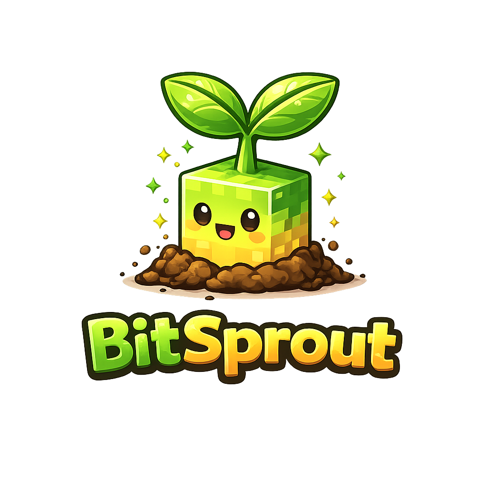

    

<h1 align="center">palmTree ETL</h1>

    A lightweight, multi-tenant ETL management platform by

    

START REDIS (on separate terminal)
brew services start redis
redis-cli ping

START CELERY TASKS (on separate terminal)
celery -A palmtree_etl worker -l info

FOLDER WATCHER (on separate terminal)
python manage.py watch_incoming

CREATE SFTP DROP FOLDER
sudo mkdir -p /srv/sftp_drops
sudo chown -R ubuntu:ubuntu /srv/sftp_drops
